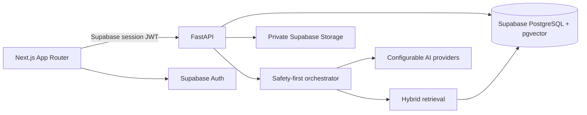
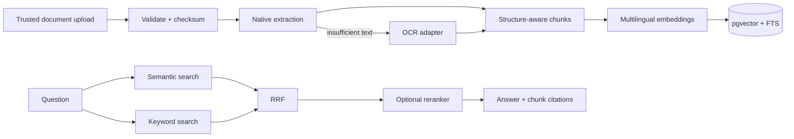
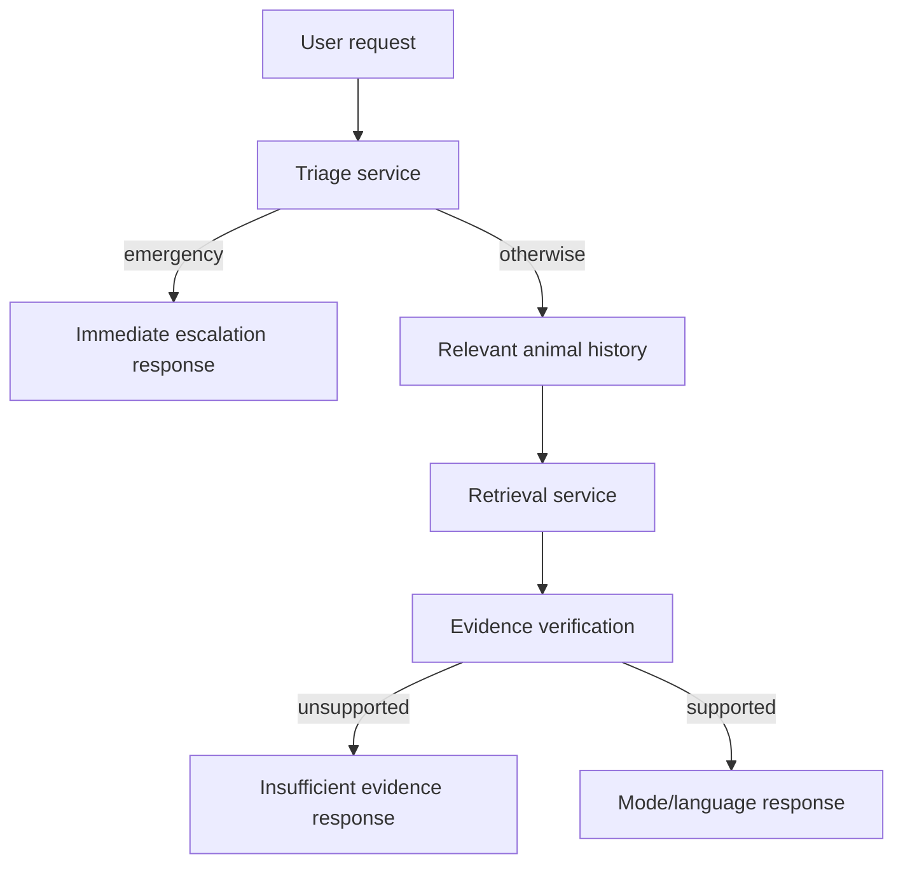

# VetEvidence — Veterinary RAG Assistant

An evidence-grounded, multilingual veterinary information and clinical decision-support application for dogs, cats, horses, cattle, buffalo, goats, sheep, and other livestock. It supports owners and veterinary professionals while explicitly avoiding definitive diagnosis or autonomous prescribing.

> This software is not a replacement for a licensed veterinarian. Emergencies require immediate veterinary assessment.

## Current capabilities

- Responsive clinical Next.js dashboard, animal profiles, timeline route, chat, English/Urdu direction support, and protected admin workspaces
- FastAPI API with Supabase JWT validation, owner-scoped animal CRUD, admin authorization from immutable app metadata, safe errors, CORS, and request IDs
- Species-aware extensible emergency triage with an emergency short-circuit
- PDF/TXT/Markdown/DOCX ingestion, SHA-256 deduplication, native extraction, OCR escalation status, structure-aware chunks, page preservation, and model metadata
- Provider interfaces for LLM, embedding, reranking, vision, STT, and TTS; missing providers disable only their capability
- Multilingual-ready embedding configuration (`BAAI/bge-m3` preferred), pgvector cosine HNSW, PostgreSQL full-text search, reciprocal-rank fusion, and optional reranking boundary
- Chunk-bound citations and explicit refusal when trusted evidence is absent
- Normalized Supabase schema, private storage buckets, and ownership RLS policies
- Evaluation dataset loader and deterministic retrieval metrics
- Docker, Render, Vercel, and Supabase deployment assets

The checked-in offline hash embedding is a deterministic development fallback only. It is intentionally identified as `hash-fallback-v1` and must not be confused with BGE-M3 clinical semantic retrieval.

## Screenshots

Add production screenshots here after deployment and visual acceptance review.

## Architecture







The orchestrator is a stateful workflow rather than a collection of renamed functions: safety can terminate the workflow; history selection scopes data; retrieval produces structured evidence; verification gates unsupported claims; response formatting changes by owner/veterinarian mode and language.

## Repository map

```text
apps/web                 Next.js App Router frontend
apps/api/app             FastAPI application, auth, models, routes
ai/agents                Orchestration
ai/embeddings            Embedding providers
ai/retrieval             Hybrid retrieval and RRF
ai/rag                   Structure-aware chunking
ai/safety                Independent triage rules
ai/evaluation            Evaluation formats and metrics
ai/prompts               Safety/system rules
ingestion                Document extraction and indexing
database/migrations      Supabase PostgreSQL, pgvector, RLS, storage
tests                    Focused API, authorization, and safety tests
docs                     Deployment guidance
docker                   API image
```

## Database overview

The production migration defines `profiles`, `user_roles`, `animals`, `animal_allergies`, `animal_conditions`, `animal_weights`, `medical_records`, `vaccinations`, `medications`, `uploaded_files`, `lab_reports`, `lab_results`, `conversations`, `messages`, `message_citations`, `knowledge_documents`, `knowledge_chunks`, `document_ingestion_jobs`, `feedback`, `rag_evaluation_runs`, `rag_evaluations`, and `audit_logs`. User-owned tables carry `owner_id`, indexed ownership checks, and RLS. Knowledge/evaluation administration is backend-only by default.

## Local setup

Requirements: Node 22+, Python 3.11–3.13 recommended, and optionally Docker.

```powershell
Copy-Item .env.example .env
python -m venv .venv
.\.venv\Scripts\Activate.ps1
python -m pip install -e ".[dev]"
uvicorn apps.api.app.main:app --reload
```

In another terminal:

```powershell
cd apps/web
npm install
npm run dev
```

Open `http://localhost:3000`; API docs are at `http://localhost:8000/docs`.

SQLite is the credential-free development fallback. For Supabase set `DATABASE_URL=postgresql+asyncpg://...`, run the SQL migration, and configure browser-safe publishable keys. The service-role key must exist only on the backend.

## Supabase and authentication

1. Create a Supabase project and run `database/migrations/0001_initial.sql`.
2. Enable email/password; configure Google in Authentication → Providers and its callback URL.
3. Set site/redirect URLs for local and production origins.
4. Copy URL and publishable/anon key into frontend environment variables.
5. Put the service role and database credentials on the API host only.
6. Inspect RLS and storage policies before production. Roles belong in `app_metadata`, never user-editable metadata.

## Adding veterinary documents

Administrators call `POST /api/v1/admin/knowledge` as multipart data with a PDF/TXT/MD/DOCX `file` and JSON `metadata` field. Mark `is_trusted` only after provenance review. Native PDF text is attempted first; low-text scans fail clearly until the optional OCR runtime/provider is configured. No bundled document is represented as authoritative clinical evidence.

Each chunk retains the document, page, section, sequence, extraction method, checksum lineage, and embedding model. Changing models requires explicit re-indexing so incompatible vectors are not mixed.

## Providers

Interfaces exist for `LLMProvider`, `EmbeddingProvider`, `RerankerProvider`, `VisionProvider`, `SpeechToTextProvider`, and `TextToSpeechProvider`. Configure them through `.env`. Browser SpeechSynthesis is the TTS fallback; availability and Urdu voice quality depend on the device. Vision and STT remain clearly unavailable until configured.

## RAG evaluation

Supply JSONL records:

```json
{"question":"...","expected_answer":"...","relevant_document_ids":["uuid"],"species":"dog","category":"triage"}
```

The runner computes Precision@K, Recall@K, hit rate, and MRR without inventing results. Answer relevance, groundedness, citation correctness, unsupported-claim rate, and latency belong in provider-backed evaluation runs after a dataset and judge configuration are supplied.

## Testing and quality

```powershell
pytest
ruff check .
cd apps/web
npm run lint
npm run build
```

Tests cover health, authentication, animal authorization/cross-user isolation, emergency and non-emergency triage, and evidence insufficiency. Add provider contract, ingestion fixture, lab parser, and browser E2E coverage before clinical pilots.

## Docker

```powershell
Copy-Item .env.example .env
docker compose up --build
```

Direct local execution remains supported. See [deployment guidance](docs/deployment.md) for Supabase, Render, and Vercel.

## Safety and security

- Retrieved text is untrusted evidence and is never interpreted as system/tool instructions.
- Emergency rules run independently before generative output.
- Medication dosing is never calculated or prescribed autonomously.
- Lab ranges are displayed only when present in the original report.
- Clinical image output must separate visible observations from possible interpretation.
- API authentication validates Supabase asymmetric JWTs; admin role comes from `app_metadata`.
- Uploads have extension and size checks; production should add malware scanning before ingestion.
- Logs avoid tokens and full sensitive records.

## Known limitations and roadmap

Credentials and authoritative veterinary PDFs are not included. Until configured, live LLM generation, BGE-M3 embeddings, reranking, vision, OCR, STT, external TTS, Google OAuth, signed storage URLs, and deployment validation cannot operate. The current response composer safely shows evidence excerpts; a configured LLM adapter must synthesize them while preserving verification gates. Complete persistent medical-record CRUD screens, transcription recording, lab table parsing, provider-specific vision analysis, and Playwright E2E are the next delivery milestones.

No clinical claims or evaluation scores are fabricated in this repository.
